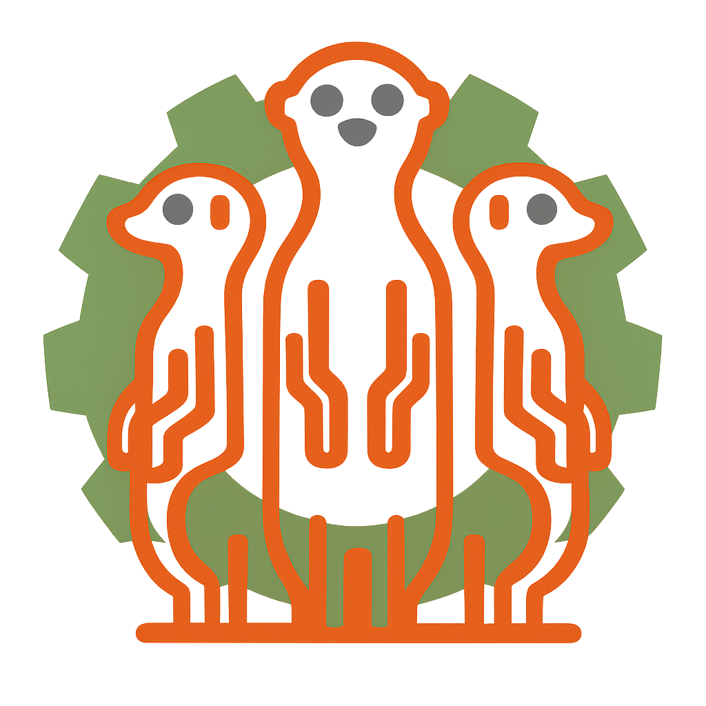
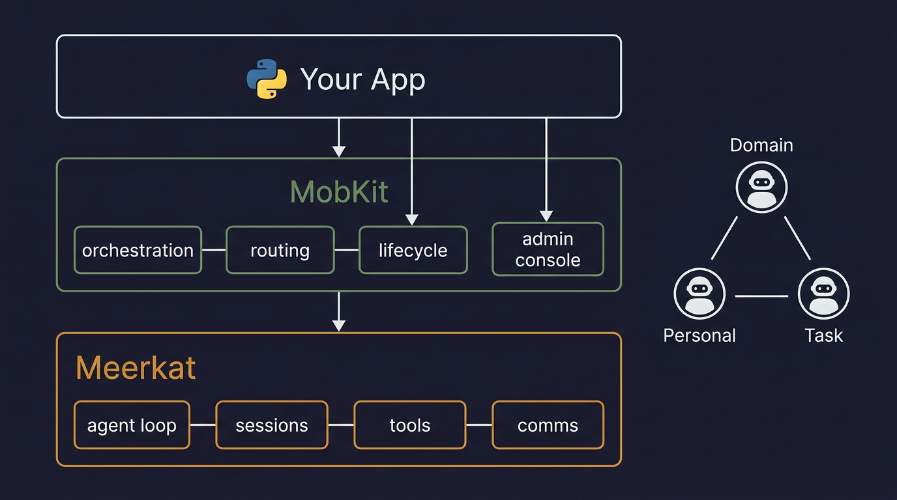

<p align="center">
  
</p>

<h1 align="center">MobKit</h1>

<p align="center">
  Build advanced multi-agent systems with a few lines of code.
</p>

<p align="center">
  <a href="LICENSE-MIT"></a>
  <a href="https://crates.io/crates/meerkat-mobkit"></a>
  <a href="https://pypi.org/project/meerkat-mobkit/"></a>
  <a href="https://www.npmjs.com/package/@rkat/mobkit-sdk"></a>
  <a href="https://www.rust-lang.org"></a>
</p>

---

MobKit lets you stand up a production multi-agent system in a few lines of code. You describe the agents you want, how they connect, and what operational capabilities they need — MobKit handles the rest: spawning, wiring, routing, lifecycle management, and a live admin console.

It builds on [Meerkat](https://github.com/lukacf/meerkat), which provides the agent runtime (prompt assembly, tool dispatch, sessions, the core agent loop). MobKit adds the orchestration layer that turns individual agents into coordinated groups.

```python
from meerkat_mobkit import MobKit

async with await MobKit.builder().mob("mob.toml").gateway("./mobkit-rpc").build() as rt:
    handle = rt.mob_handle()
    await handle.send("agent-1", "Review PR #42")
```

<p align="center">
  
</p>

## What you can build

MobKit's primary pattern is layered agent architectures — but it's not limited to any single topology:

- **Domain agents** that own a capability (email, calendar, code review, data analysis)
- **Personal agents** that represent a user and delegate to domain agents
- **Group agents** that coordinate across a team or initiative
- **Task agents** that are spawned on demand for short-lived work

You define agents as profiles in a mob config, wire them together with peer connections, and MobKit handles the lifecycle: spawning at startup, retiring when no longer needed, respawning on failure, and reconciling the roster when your desired topology changes.

## Features

- **Orchestration** — bootstrap an entire mob and its operational modules in a single call, with process supervision, health gates, and configurable restart policies
- **Roster management** — list, inspect, spawn, retire, and respawn members; ensure agents exist before sending them work; reconcile the roster against a desired state
- **Operational subsystems** — message routing with sink adapters, risk-based approval gates, cron scheduling with timezone support, and semantic memory
- **Admin console** — React web UI with agent sidebar, activity feed, chat inspector, topology view, and health overview — all updating in real time via SSE
- **Session persistence** — JSON file storage for development, BigQuery adapter for production
- **Authentication** — JWT/OIDC validation with JWKS discovery and email allowlists
- **SDKs** — Python, TypeScript, and Rust with typed returns and contract parity tests

## Install

```bash
# Python
pip install meerkat-mobkit

# TypeScript
npm install @rkat/mobkit-sdk

# Rust
cargo add meerkat-mobkit
```

## Quick start

```python
from meerkat_mobkit import MobKit

async with await MobKit.builder().mob("mob.toml").gateway("./mobkit-rpc").build() as rt:
    handle = rt.mob_handle()

    # Send work to an agent
    result = await handle.send("agent-1", "Review PR #42")
    print(result.session_id)

    # Watch what happens
    async for event in handle.subscribe_agent("agent-1"):
        print(event.event_type, event.data)

    # Manage the roster
    members = await handle.list_members()
    await handle.retire_member("agent-1")
    await handle.ensure_member("user-123", profile="personal")
```

## MobKit and Meerkat

| | Meerkat | MobKit |
|---|---|---|
| **Role** | Agent runtime — runs individual agents | Orchestration — coordinates groups of agents |
| **Owns** | Agent loop, prompt assembly, tool dispatch, sessions, comms | Startup, routing, lifecycle management, operational subsystems |
| **Interface** | Library crate, CLI, REST, RPC, MCP | Library crate, JSON-RPC, admin console, SDKs |

Meerkat is the engine that makes each agent work. MobKit is the toolkit that makes them work together.

## Repository layout

| Path | Description |
|------|-------------|
| `meerkat-mobkit/` | Rust crate (core orchestration engine) |
| `sdk/python/` | Python SDK (`meerkat-mobkit` on PyPI) |
| `sdk/typescript/` | TypeScript SDK (`@rkat/mobkit-sdk` on npm) |
| `console/` | React admin console (embedded in the binary) |
| `docs/` | Documentation site (Mintlify) |

## Development

```bash
make ci          # Full CI pipeline (fmt, lint, test, audit)
make test        # Rust tests
make test-python # Python SDK tests
make lint        # Clippy
make help        # All available targets
```

## Documentation

Full documentation at [docs.rkat.ai](https://docs.rkat.ai).

## License

Dual-licensed under [MIT](LICENSE-MIT) and [Apache 2.0](LICENSE-APACHE).
