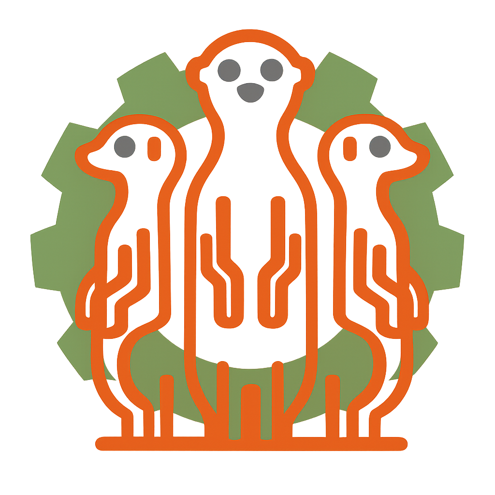
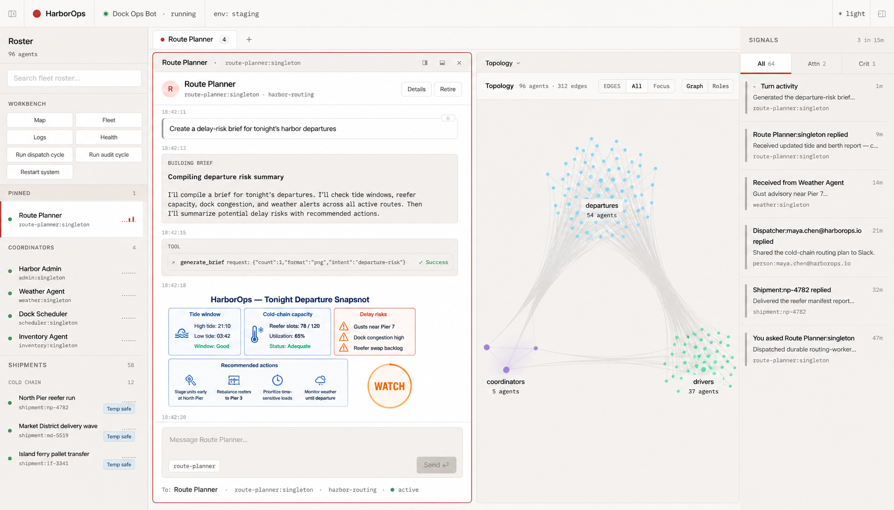

<p align="center">
  
</p>

<h1 align="center">MobKit</h1>

<p align="center">
  A thin convenience, gateway, SDK, and console layer for identity-first Meerkat mobs.
</p>

<p align="center">
  <a href="LICENSE-MIT"></a>
  <a href="https://crates.io/crates/meerkat-mobkit"></a>
  <a href="https://pypi.org/project/meerkat-mobkit/"></a>
  <a href="https://www.npmjs.com/package/@rkat/mobkit-sdk"></a>
  <a href="https://www.rust-lang.org"></a>
</p>

---

MobKit is the application-facing convenience layer around identity-first Meerkat mobs. It gives host apps a stable way to boot a mob, project it into a console, expose JSON-RPC/REST/SSE control surfaces, and use Python or TypeScript SDKs without hand-wiring every Meerkat primitive.

MobKit does not replace Meerkat or `meerkat-mob`. Meerkat owns the session runtime and agent loop. `meerkat-mob` is already identity-first: it owns the multi-agent runtime path, `AgentIdentity` vs `AgentRuntimeId` binding model, mob membership, lifecycle, wiring, flows, supervisor bridge, and mob event authority. `meerkat-mobkit` mostly packages convenience around that substrate: gateway startup, SDK ergonomics, provider adapters, operational-module wiring, and rebuildable console/timeline projections.

<p align="center">
  
</p>

## What MobKit Is For

MobKit is useful when a system needs agents that keep meaning over time:

- **Personal agents** such as `identity:luka` that represent a person and receive direct conversational work
- **Domain agents** such as `domain:calendar` or `domain:school` that own a durable capability
- **Coordination agents** such as `triage:main`, `family-group:main`, or `gate:main` that route, summarize, or approve work
- **Task agents** that can still be spawned for short-lived execution while the durable identities stay stable

The important idea is that the app talks to identities, not throwaway runtime members. A runtime member can be created, resumed, retired, respawned, or rematerialized, but `identity:luka` remains the app-facing handle.

## Identity-First Mobs

Identity-first is a `meerkat-mob` contract that MobKit exposes conveniently.

In `meerkat-mob`, stable member identity is separate from runtime binding:

- **`AgentIdentity`.** The public member identity. It survives respawn and runtime-binding changes and keys public mob APIs.
- **`AgentRuntimeId`.** The current runtime binding. It can rotate when a member is respawned or rebound.
- **`FenceToken`.** A monotonic binding epoch used by guards to reject stale binding-level work.
- **`Generation`.** The mob-member generation counter, incremented on respawn.

MobKit's identity-facing surface should be read as convenience over that model. The SDKs, gateway, and console let an app address `identity:luka` or `triage:main`, inspect current binding state, and recover members without forcing the app to manage the underlying mob/session plumbing directly.

That gives host apps a few concrete guarantees:

- **Stable addressing.** Send to `identity:luka` or dispatch to `triage:main` using the same identity handle the mob uses internally.
- **Runtime-binding transparency.** Console and SDK calls can show or act on the current runtime binding without making binding ids the public API.
- **Recovery ergonomics.** MobKit can expose recover/respawn/rematerialize-style operator controls, but the semantic model remains the mob identity/binding model.
- **Rebuildable projections.** Console timelines, identity rows, and sidebar grouping are projections of mob/runtime truth, not separate authorities.

For local and embedded deployments, `.persistent_state(...)` creates SQLite-backed MobKit metadata, console logs, runtime state, session state, and blob storage under one directory. For externally authoritative deployments, MobKit can be paired with app-provided stores/providers, but those should adapt to the identity-first mob substrate rather than inventing a parallel identity authority.

## Quick Start

```python
from meerkat_mobkit import MobKit
from meerkat_mobkit.identity_first_models import DurableAgentSpec, ManagedPeerEdge


class Roster:
    async def roster(self, ctx):
        return [
            DurableAgentSpec(
                identity="identity:luka",
                profile="personal",
                addressability="addressable",
            ),
            DurableAgentSpec(
                identity="triage:main",
                profile="triage",
                addressability="internal_only",
            ),
            DurableAgentSpec(
                identity="domain:calendar",
                profile="calendar",
                addressability="internal_only",
            ),
        ]


class Topology:
    async def compute_edges(self, target_identities, ctx):
        return [
            ManagedPeerEdge(a="identity:luka", b="triage:main"),
            ManagedPeerEdge(a="triage:main", b="domain:calendar"),
        ]


rt = await (
    MobKit.builder()
    .mob("config/mob.toml")
    .persistent_state(".mobkit/state")
    .roster(Roster())
    .topology_provider(Topology())
    .gateway("./target/debug/mobkit_gateway")
    .build()
)

luka = rt.agent("identity:luka")
triage = rt.agent("triage:main")

await triage.dispatch_text("New calendar event needs triage", origin="connector")
await luka.send("What needs my attention before lunch?")

print(await luka.wait_for_output(timeout=60))
```

## Console

The bundled React console is served by the runtime and talks to the same contracts SDKs use:

- `GET /console/experience` for console configuration, roster projection, identity status, and runtime capabilities
- `POST /console/rpc` for console commands such as send, inspect identity, query timeline, routing, delivery, and gating
- `GET /console/timeline` and `GET /console/timeline/stream` for replayable console frames and live continuation
- `GET /console/identity/{identity}/stream` for identity-scoped event streams
- `/blobs/{id}` and multipart console RPC for image and attachment flows

Host apps can shape the stock console with `config/console.toml`: branding, theme, environment labels, layout presets, sidebar grouping, default pins, rail filters, action labels, and host-provided links. The console stays a projection of runtime truth; host apps own policy and domain-specific decisions.

## Core Capabilities

- **Unified runtime bootstrap.** Build a Meerkat mob and MobKit operational surface in one runtime.
- **Identity-first convenience.** SDK, gateway, and console affordances for the `meerkat-mob` identity-first binding model.
- **Operational modules.** Routing, delivery, scheduling, gating, memory, session-store adapters, metadata, and event transport.
- **Console projection.** Roster, topology, conversations, activity signals, logs, health, approvals, timeline replay, and live SSE updates.
- **SDKs.** Rust exports plus Python and TypeScript clients with typed identity-first, mob, event, memory, routing, delivery, and gating APIs.
- **Auth and deployment controls.** JWT/OIDC validation, console route protection, peer keys, release metadata checks, and conventional config discovery.

## Meerkat vs `meerkat-mob` vs `meerkat-mobkit`

| | Meerkat | `meerkat-mob` | `meerkat-mobkit` |
|---|---|---|---|
| **Primary job** | Runs agent sessions | Runs the multi-agent runtime | Makes mobs easy to boot, expose, observe, and operate |
| **Owns** | Agent loop, prompt assembly, tool execution, session runtime, session persistence primitives | MobMachine authority, `AgentIdentity` / `AgentRuntimeId` / `FenceToken` / `Generation`, membership, provisioning, lifecycle, wiring, flows, supervisor bridge, mob events | Gateway and builder ergonomics, provider adapters, JSON-RPC/REST/SSE packaging, SDK transport, operational-module wiring, console/timeline projections |
| **App-facing handles** | Session ids and agent runtime APIs | `AgentIdentity`, `MobHandle`, member snapshots, mob events | The same mob identities surfaced through SDK handles, console rows, timelines, and convenience methods |
| **Typical surface** | Rust crates, CLI, REST/RPC/MCP surfaces in the Meerkat repo | Rust mob APIs and event streams | Rust crate, `mobkit_gateway`, JSON-RPC, REST/SSE console routes, Python SDK, TypeScript SDK |
| **Boundary rule** | If it changes how a single session executes, it belongs here | If it changes what a mob member is, how members bind, or how a mob transitions, it belongs here | If it is bootstrapping, packaging, projection, host integration, or operator ergonomics, it can live here |

## Install

```bash
# Python
pip install meerkat-mobkit

# TypeScript
npm install @rkat/mobkit-sdk

# Rust
cargo add meerkat-mobkit
```

## Repository Layout

| Path | Description |
|------|-------------|
| `meerkat-mobkit/` | Rust crate, gateway binaries, runtime adapters, RPC, HTTP, console contracts |
| `sdk/python/` | Python SDK (`meerkat-mobkit` on PyPI) |
| `sdk/typescript/` | TypeScript SDK (`@rkat/mobkit-sdk` on npm) |
| `console/` | React console source and browser smoke harness |
| `packages/console-core/` | Console data adapters and headless core logic |
| `packages/console-components/` | Reusable React console components |
| `docs/` | Mintlify documentation site |
| `examples/` | Example packs and runtime demos |

## Development

```bash
make ci                         # Full CI pipeline
make test                       # Rust tests
make test-python                # Python SDK tests
npm --prefix console run build  # Rebuild embedded console assets
```

Useful focused checks:

```bash
npm --prefix console run phase0:types --silent
npm --prefix console run embedded:freshness --silent
./scripts/repo-cargo check -p meerkat-mobkit
```

## Documentation

Full documentation is available in the [MobKit section of docs.rkat.ai](https://docs.rkat.ai/mobkit/introduction).

## License

Dual-licensed under [MIT](LICENSE-MIT) and [Apache 2.0](LICENSE-APACHE).
