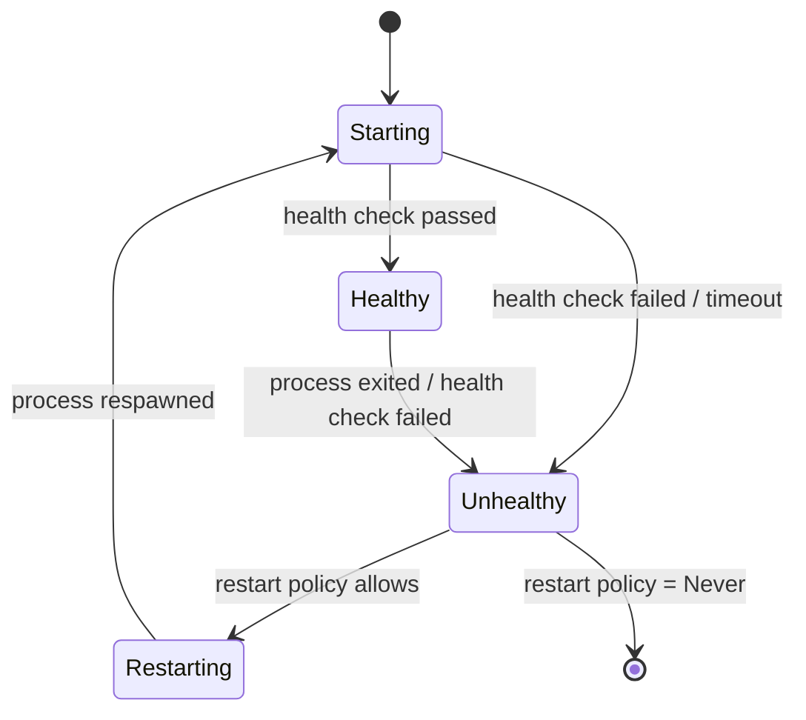

MobKit's module system manages the lifecycle, routing, and communication for operational subsystems. This guide covers how module calls are routed, how MCP boundaries work, and how the supervisor manages process health.

## Module call routing

When the runtime needs to invoke a module -- for a delivery send, schedule evaluation, or gating decision -- it routes the call through `route_module_call`:

```rust
let response = route_module_call(&runtime_handle, ModuleRouteRequest {
    module_id: "delivery",
    tool: "delivery.send",
    arguments: json!({ "route_id": "...", "payload": { ... } }),
})?;
```

The routing layer:

1. Looks up the module by ID in the loaded modules table
2. Checks if the module uses MCP (core modules) or the subprocess JSON-line protocol
3. Dispatches the call through the appropriate boundary

## MCP boundary

Core modules (router, delivery, scheduling, gating, memory) communicate over MCP tool calls. The MCP boundary:

- Serializes the tool name and arguments to JSON
- Sends the request to the module's MCP server
- Parses the response and extracts the result payload
- Applies a timeout (`CORE_MODULE_MCP_TIMEOUT`) to prevent hung modules

```rust
let result = call_module_mcp_tool_json(
    &module_process,
    "delivery.send",
    &json!({ "route_id": "...", "payload": { ... } }),
    CORE_MODULE_MCP_TIMEOUT,
)?;
```

### MCP requirement checking

Before dispatching, the boundary verifies the module supports MCP:

```rust
if !module_uses_mcp(&module_config) {
    return Err(mcp_required_error(&module_config.id, &tool_name));
}
```

Non-MCP modules receive calls through the subprocess JSON-line protocol instead.

## Subprocess protocol

Non-MCP modules communicate over a JSON-line protocol on stdout/stderr:

<Steps>
  <Step title="Spawn">
    The supervisor spawns the module process with the configured command and arguments.
  </Step>
  <Step title="Capabilities handshake">
    The first line of stdout must be a JSON capabilities declaration:

    ```json
    {"contract_version": "0.1.0"}
    ```

    The runtime validates the contract version matches `MOBKIT_CONTRACT_VERSION` (`"0.1.0"`).
  </Step>
  <Step title="Request/Response">
    Subsequent communication uses JSON-RPC over the JSON-line protocol. Each line is a complete JSON object.
  </Step>
</Steps>

### RPC routing

Subprocess modules receive JSON-RPC requests routed by method name:

```rust
let response = route_module_call_rpc_subprocess(
    &module_process,
    &JsonRpcRequest {
        jsonrpc: "2.0".to_string(),
        id: Some(json!(1)),
        method: "scheduling.evaluate".to_string(),
        params: json!({ "schedules": [...] }),
    },
)?;
```

## Supervisor

The supervisor manages module process lifecycle:

### Health tracking

Each module transitions through health states:



### Health transitions

Health transitions are recorded as `ModuleHealthTransition` events and emitted into the unified event stream:

```rust
ModuleHealthTransition {
    module_id: "delivery",
    from: ModuleHealthState::Starting,
    to: ModuleHealthState::Healthy,
    timestamp_ms: 1709500000000,
}
```

### Restart behavior

| Policy | On exit code 0 | On non-zero exit | On signal |
|--------|---------------|------------------|-----------|
| `Never` | Stop | Stop | Stop |
| `OnFailure` | Stop | Restart | Restart |
| `Always` | Restart | Restart | Restart |

## Module boundary errors

The boundary layer produces typed errors:

| Error | Cause |
|-------|-------|
| `McpBoundaryError::InvalidToolPayload` | MCP response could not be parsed |
| `McpBoundaryError::ToolNotFound` | Module does not expose the requested tool |
| `McpBoundaryError::Timeout` | MCP call exceeded timeout |
| `ProcessBoundaryError` | Subprocess communication failed |
| `RpcRouteError` | JSON-RPC method routing failed |

## Running a module once

For testing or one-off execution, use `run_module_boundary_once`:

```rust
let result = run_module_boundary_once(
    &module_config,
    &json!({ "action": "test" }),
)?;
```

This spawns the module, sends a single request, collects the response, and terminates the process.

## See also

- [Modules](/concepts/modules) -- module configuration and discovery
- [Events](/concepts/events) -- health transition events
- [RPC API](/api/rpc) -- module-level RPC methods
