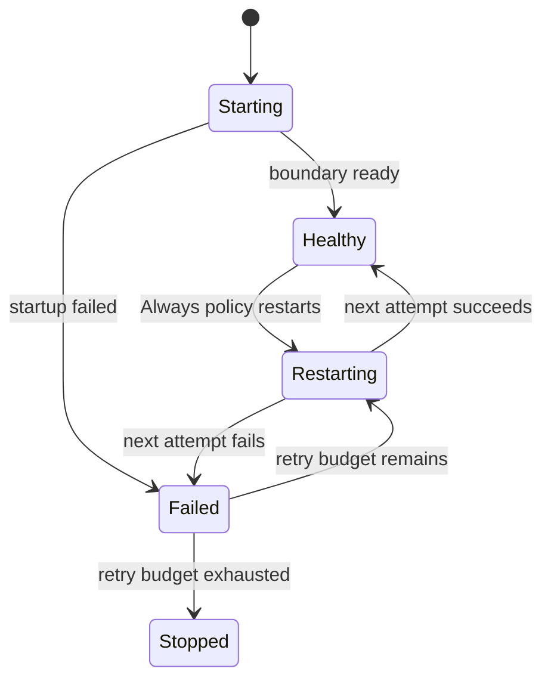

MobKit modules are subprocesses declared in `MobKitConfig`. The runtime resolves
each discovered module, selects its process boundary, records startup health,
and exposes module operations through `UnifiedRuntime`.

## Route a module call

Use the host-facing `UnifiedRuntime::route_module_call` method. A request names
the configured module, the method or MCP tool, and its JSON parameters:

```rust
use meerkat_mobkit::ModuleRouteRequest;
use serde_json::json;
use std::time::Duration;

let request = ModuleRouteRequest {
    module_id: "delivery".to_string(),
    method: "delivery.send".to_string(),
    params: json!({
        "route_id": "route-1",
        "payload": { "message": "hello" }
    }),
};

let response = runtime
    .route_module_call(&request, Duration::from_secs(5))
    .await?;
```

The routing layer:

1. Verifies that `module_id` is loaded
2. Resolves the matching `ModuleConfig` and optional `PreSpawnData`
3. Selects the MCP boundary when the pre-spawn environment contains
   `MOBKIT_MODULE_BOUNDARY=mcp`
4. Returns `ModuleRouteResponse { module_id, method, payload }`

## MCP boundary

Mark a module as MCP through its pre-spawn environment:

```rust
use meerkat_mobkit::PreSpawnData;

let boundary = PreSpawnData {
    module_id: "delivery".to_string(),
    env: vec![(
        "MOBKIT_MODULE_BOUNDARY".to_string(),
        "mcp".to_string(),
    )],
};
```

For an MCP module, a routed call connects to the configured stdio server,
lists its tools, invokes `request.method` with `request.params`, and closes the
connection. The caller-provided timeout bounds connect, list, call, and close
operations.

The core module IDs `router`, `delivery`, and `memory` require MCP. Routing one
of those IDs without the MCP marker fails with
`ModuleRouteError::ModuleRuntime(RuntimeBoundaryError::Mcp(McpBoundaryError::McpRequired { .. }))`.
There is no event-line fallback for those core flows.

## Event-line boundary

A module without the MCP marker uses the event-line boundary. The process must
write a JSON event as its first stdout line. For example:

```json
{
  "event_id": "evt-module-1",
  "source": "module",
  "timestamp_ms": 1709500000000,
  "module": "analytics",
  "event_type": "analytics.ready",
  "payload": { "status": "ready" }
}
```

The runtime normalizes that line into `EventEnvelope<UnifiedEvent>`. On this
boundary, `route_module_call` launches the module and returns the first
normalized module event's `payload` field as `ModuleRouteResponse.payload`. It
does not include the event envelope metadata or the normalized event's `module`
and `event_type` fields in that payload. It also does not write
`request.method` or `request.params` to the module's stdin. Use MCP when the
subprocess needs a request/response tool-call contract.

For a discovered one-shot module that emits one event and exits, use the public
configuration-aware helper:

```rust
use meerkat_mobkit::run_discovered_module_once;
use std::time::Duration;

let event = run_discovered_module_once(
    &config,
    "analytics",
    Duration::from_secs(5),
)?;
```

The helper verifies that the module is both configured and discovered, applies
its matching `PreSpawnData`, executes it once, and returns the normalized event.

## Startup health

The module supervisor records startup transitions. Read them through the
unified runtime:

```rust
for transition in runtime.module_health_transitions().await {
    println!(
        "{}: {:?} -> {:?} (attempt {})",
        transition.module_id,
        transition.from,
        transition.to,
        transition.attempt,
    );
}
```

`ModuleHealthTransition` has four fields:

| Field | Type | Meaning |
|-------|------|---------|
| `module_id` | `String` | Configured module ID |
| `from` | `Option<ModuleHealthState>` | Previous state, or `None` for the initial transition |
| `to` | `ModuleHealthState` | New state |
| `attempt` | `u32` | Startup attempt number; the initial `Starting` transition uses `0` |

`ModuleHealthState` has exactly these variants:

| State | Meaning |
|-------|---------|
| `Starting` | The startup attempt has begun |
| `Healthy` | The boundary produced a valid first event or the MCP tool probe succeeded |
| `Failed` | The current startup or restart attempt failed |
| `Restarting` | The supervisor will make another non-MCP startup attempt |
| `Stopped` | Startup exhausted its retry policy |


```mermaid
stateDiagram-v2
    [*] --> Starting
    Starting --> Healthy : boundary ready
    Starting --> Failed : startup failed
    Failed --> Restarting : retry budget remains
    Restarting --> Healthy : next attempt succeeds
    Restarting --> Failed : next attempt fails
    Healthy --> Restarting : Always policy restarts
    Failed --> Stopped : retry budget exhausted
```

### Restart policies

For event-line modules, restart behavior is bounded by `RuntimeOptions`:

| Policy | Startup failure | Successful first event |
|--------|-----------------|------------------------|
| `Never` | Do not retry | Keep the child and mark it healthy |
| `OnFailure` | Retry while `on_failure_retry_budget` remains | Keep the child and mark it healthy |
| `Always` | Retry while `always_restart_budget` remains | Restart while `always_restart_budget` remains, then keep the final healthy child |

MCP startup probes the configured tool server once. It records
`Starting -> Healthy` on success or `Starting -> Failed -> Stopped` on failure;
the event-line restart budgets are not applied to that probe.

## Boundary errors

The public routing path preserves the boundary that failed:

| Error | Cause |
|-------|-------|
| `ModuleRouteError::UnloadedModule` | The requested module is not loaded |
| `ModuleRouteError::ModuleRuntime` | The process, normalization, or MCP boundary failed |
| `ModuleRouteError::UnexpectedRouteResponse` | The event-line process returned a non-module event or the wrong module ID |
| `RuntimeBoundaryError::Process` | Process spawn, stdout, timeout, or JSON-line I/O failed |
| `RuntimeBoundaryError::Normalize` | The first event line did not satisfy the unified event contract |
| `RuntimeBoundaryError::Mcp` | MCP setup, discovery, tool call, close, or response parsing failed |

## See also

- [Modules](/concepts/modules) - module configuration and discovery
- [Events](/concepts/events) - unified event envelopes
- [RPC API](/api/rpc) - module-level RPC methods
