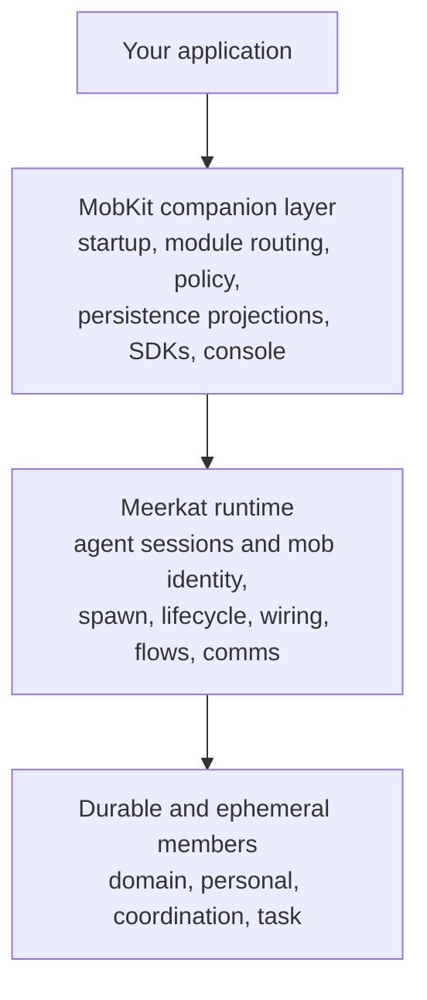

MobKit lets an application boot, expose, observe, and operate a production
Meerkat mob without hand-wiring every host integration. You describe desired
agents, topology, and operational policy. MobKit packages gateway startup,
module routing, policy enforcement, persistence projections, SDKs, and a live
operator console around that runtime.

[Meerkat](https://github.com/lukacf/meerkat) already owns both individual-agent
execution and multi-agent mob orchestration: prompt assembly, tools, sessions,
stable member identity, spawning, lifecycle, wiring, flows, comms, and
coordination. MobKit is the companion product and gateway layer. It invokes
those primitives and projects them for applications and operators; it does not
replace `meerkat-mob` or maintain a second mob authority.

```python
rt = await (
    MobKit.builder()
    .mob("mob.toml")
    .persistent_state("./state")
    .roster(my_roster)
    .gateway("./rpc_gateway")
    .build()
)

triage = rt.agent("triage:main")
luka = rt.agent("identity:luka")

await triage.dispatch_text("New event", origin="connector")
# send_and_wait waits on the turn's completion cursor, so it is correct even
# when the agent answers the same thing twice.
output = await luka.send_and_wait("What's happening?", timeout=60)
```



## What you can build

MobKit's primary pattern is layered agent architectures — but it's not limited to any single topology:

- **Domain agents** that own a capability (email, calendar, code review, data analysis)
- **Personal agents** that represent a user and delegate to domain agents
- **Group agents** that coordinate across a team or initiative
- **Task agents** that are spawned on demand for short-lived work

You define profiles and wiring in a Meerkat mob config. MobKit's startup and
roster layers submit desired members and topology to the Meerkat mob runtime,
invoke its spawn, retire, respawn, and wiring operations, and reconcile the
host's desired state against the resulting runtime projection.

## What MobKit provides

- **Unified startup.** Bootstrap a Meerkat mob and MobKit operational modules
  through one composition root, with health supervision and bounded rollback.
- **Identity-first convenience.** Expose Meerkat `AgentIdentity` through roster
  providers, topology providers, lease-fenced host continuity records, SDK
  handles, and console projections.
- **Operator workflows.** Invoke Meerkat member lifecycle and topology
  operations, then reconcile application desired state with runtime truth.
- **Operational subsystems.** Compose module routing and delivery, approval
  gates, durable scheduling adapters, WorkGraph integration, and optional
  memory record and retrieval providers.
- **Admin console.** Serve a React workbench with identity and roster views,
  conversations, topology, approvals, health, timeline replay, and live SSE.
- **Persistence projections.** Store MobKit continuity, lease, metadata,
  timeline, blob, schedule, and agent-memory records through a declared storage
  provider. Persistent mode fails closed instead of silently falling back to
  memory. Meerkat remains the owner of canonical session and mob durability.
- **Authentication and policy.** Apply JWT/OIDC authentication, coarse
  server-side read-only policy, and optional deny-by-default ABAC across
  console REST, RPC, and SSE.
- **SDKs.** Use Python and TypeScript clients with typed returns and contract
  parity tests against the Rust core.

## MobKit and Meerkat

| | Meerkat | MobKit |
|---|---|---|
| **Role** | Agent and multi-agent mob runtime | Companion application and operator layer |
| **Owns** | Agent loop, prompt assembly, tools, sessions, mob orchestration, `AgentIdentity`, membership, spawn, lifecycle, wiring, flows, comms, coordination | Gateway startup, host desired-state providers, module routing and delivery, operational policy, MobKit persistence projections, SDK transport, console and timeline UX |
| **Interface** | Rust crates, CLI, REST, JSON-RPC, MCP, and SDKs | Rust composition crate, `rpc_gateway`, `mobkit_gateway`, JSON-RPC/REST/SSE packaging, Python and TypeScript SDKs, console |

Meerkat runs agents and mobs. MobKit makes that runtime convenient to embed,
integrate, expose, and operate as a product.

## Explore the documentation

<CardGroup cols={2}>
  <Card title="Quickstart" icon="rocket" href="/quickstart">
    Bootstrap a runtime with modules and a Meerkat mob in under a minute.
  </Card>
  <Card title="Core Concepts" icon="shapes" href="/concepts/modules">
    Modules, events, gating, delivery, durable scheduling, memory, and sessions.
  </Card>
  <Card title="Guides" icon="book-open" href="/guides/unified-runtime">
    Step-by-step walkthroughs for the unified runtime, module system, and console.
  </Card>
  <Card title="Architecture" icon="layer-group" href="/reference/architecture">
    Internal architecture, crate structure, and design decisions.
  </Card>
  <Card title="APIs" icon="plug" href="/api/rpc">
    JSON-RPC, REST, and SSE protocol references.
  </Card>
  <Card title="SDKs" icon="code" href="/sdks/rust">
    Rust, TypeScript, and Python SDK documentation.
  </Card>
</CardGroup>
