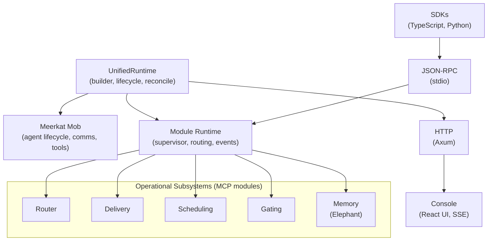
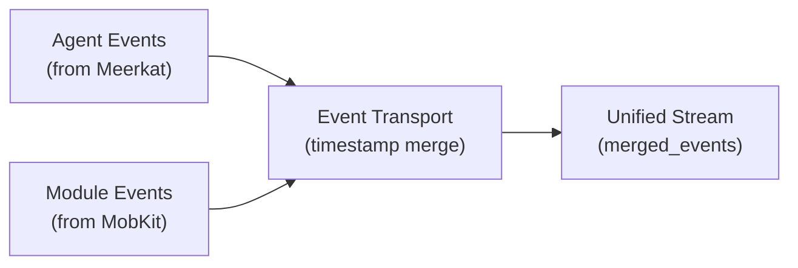

MobKit is a single Rust crate (`meerkat-mobkit`) with a React console, designed as a companion to the Meerkat multi-agent runtime. It handles the operational concerns that surround agent execution: startup, module supervision, delivery, scheduling, gating, memory, sessions, and administration.

## Design principles

1. **Data over callbacks** -- module communication uses serialized JSON messages, not function pointers or trait objects
2. **Hot paths in-process** -- core routing and event merging happen in the main process; operational subsystems run as MCP modules
3. **Two modes** -- library mode (direct Rust calls) and RPC mode (JSON-RPC via stdio) for the same functionality
4. **Single-replica v0.1** -- the first release targets single-process deployments with proven implementations

## High-level architecture



## Crate structure

MobKit is organized as a single crate with internal modules:

```
meerkat-mobkit/src/
├── lib.rs                    # Public API exports (~92 items)
├── types.rs                  # Core data structures
├── auth.rs                   # JWT/OIDC validation
├── baseline.rs               # Meerkat prerequisite verification
├── decisions.rs              # Policy enforcement
├── governance.rs             # Release candidate tracking
├── http_console.rs           # Console REST/JSON handlers
├── http_sse.rs               # SSE interaction endpoint
├── mob_handle_runtime.rs     # Meerkat mob integration
├── process.rs                # Subprocess JSON-line protocol
├── protocol.rs               # Event protocol parsing
├── rpc.rs                    # JSON-RPC handler + sub-modules
│   ├── console_ingress.rs
│   ├── gating_methods.rs
│   ├── memory_methods.rs
│   ├── routing_delivery_methods.rs
│   ├── scheduling_methods.rs
│   ├── session_store_methods.rs
│   └── subscribe_methods.rs
├── runtime/                  # Runtime implementation
│   ├── mod.rs                # Core runtime (28KB)
│   ├── bootstrap.rs          # Module startup
│   ├── delivery.rs           # Delivery subsystem
│   ├── event_transport.rs    # Event stream merging
│   ├── gating.rs             # Gating subsystem
│   ├── memory.rs             # Elephant integration
│   ├── module_boundary.rs    # MCP/subprocess boundary
│   ├── routing.rs            # Route resolution
│   ├── scheduling.rs         # Schedule evaluation
│   ├── session_store.rs      # Persistence backends
│   └── supervisor.rs         # Process supervision
├── unified_runtime.rs        # Combined mob + module runtime
└── mocks.rs                  # Test utilities
```

## Module boundary

The module boundary layer provides two communication paths:

### MCP path (core modules)

Core modules expose MCP tools. The boundary calls `call_module_mcp_tool_json` with a tool name and arguments, receives a JSON response, and parses it into the expected type.

```
Runtime → call_module_mcp_tool_json → Module MCP Server → Response → Parse
```

Key MCP tools per module:

| Module | Tools |
|--------|-------|
| router | `routing.resolve` |
| delivery | `delivery.send` |
| scheduling | `scheduling.dispatch` |
| gating | `gating.evaluate`, `gating.decide` |
| memory | `memory.index`, `memory.query`, `memory.conflict_read` |

### Subprocess path (custom modules)

Custom modules communicate over JSON lines on stdio. The boundary uses `run_process_json_line` to send a request and read a response.

```
Runtime → write JSON line to stdin → Module process → read JSON line from stdout → Parse
```

## Event transport

The event transport merges two event sources:



Events are sorted by `timestamp_ms`. Same-timestamp events preserve source ordering (agent before module).

## Supervisor design

The supervisor manages module processes with a simple state machine:

| Input | From state | To state | Action |
|-------|------------|----------|--------|
| Process spawned | -- | Starting | Begin health polling |
| Health check OK | Starting | Healthy | Mark ready |
| Health check fail | Starting | Unhealthy | Check restart policy |
| Process exit (0) | Healthy | Unhealthy | Check restart policy |
| Process exit (non-0) | Healthy | Unhealthy | Check restart policy |
| Restart triggered | Unhealthy | Restarting | Respawn process |
| Respawn complete | Restarting | Starting | Begin health polling |

## HTTP composition

The runtime composes two Axum router layers:

| Layer | Routes | Purpose |
|-------|--------|---------|
| Frontend | `/console`, `/console/assets/*` | Static HTML + JS |
| JSON API | `/console/experience`, `/console/modules` | Runtime state |

Routers are merged into a single `axum::Router` served on the configured port.

## Dependencies

### External crates

| Crate | Purpose |
|-------|---------|
| `tokio` | Async runtime |
| `axum` | HTTP framework |
| `serde` / `serde_json` | Serialization |
| `reqwest` | HTTP client |
| `chrono` / `chrono-tz` | Time and timezone |
| `ring` / `hmac` / `sha2` | Cryptography |
| `toml` | Configuration parsing |

### Meerkat crates

| Crate | Used for |
|-------|----------|
| `meerkat-core` | Agent events, session types, comms |
| `meerkat-mob` | Mob runtime, member specs, event routing |
| `meerkat-mcp` | MCP protocol types |
| `meerkat-client` | LLM client (for mob bootstrap) |

## Security model

1. **Trusted modules** -- only modules declared in `mobkit.toml` are loaded
2. **JWT validation** -- OIDC-based auth with local signature verification
3. **Email allowlist** -- access restricted to configured identities
4. **Forged resolution detection** -- delivery validates routing resolutions against trusted store
5. **Rate limiting** -- per-route sliding window rate limits on delivery

## See also

- [Modules](/concepts/modules) -- module configuration
- [Unified runtime guide](/guides/unified-runtime) -- bootstrap details
- [Decisions](/reference/decisions) -- policy enforcement
- [Meerkat architecture](https://github.com/lukacf/meerkat) -- the companion runtime
