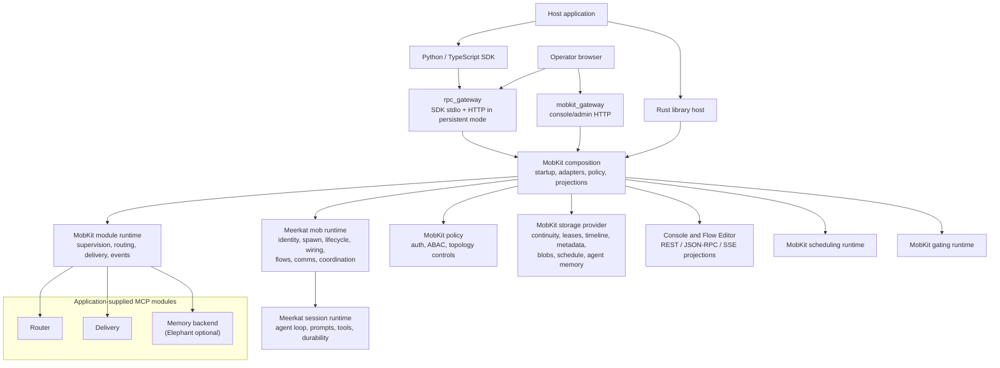
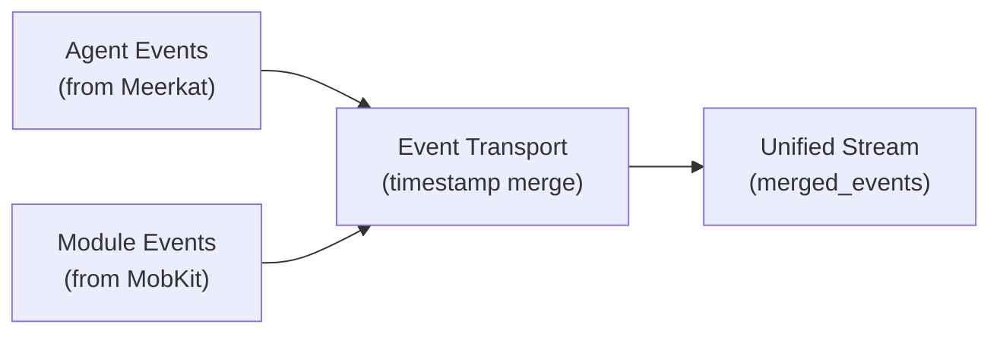

MobKit is a Rust composition crate plus gateway binaries, SDKs, examples, a
Flow Editor, and a React console. It is a companion to Meerkat, not a second
multi-agent runtime.

Meerkat owns individual-agent execution and multi-agent mob orchestration:
session construction, prompt and tool execution, stable `AgentIdentity`, mob
membership, spawn, lifecycle, wiring, flows, comms, coordination, and machine
authority. MobKit owns application-facing composition around that substrate:
startup, host desired-state providers, module routing and delivery, operational
policy, MobKit persistence projections, gateway and SDK transport, console
timeline projection, and operator UX.

## Design principles

1. **One upstream runtime authority** - MobKit invokes Meerkat mob operations;
   it does not become a second authority for membership, lifecycle, wiring, or
   session truth.
2. **Data at process boundaries** - module and gateway communication uses
   typed serialized messages. In-process Rust hosts may use typed traits and
   builders without inventing a second wire contract.
3. **Projection, not authority** - console rows, timelines, identity views,
   and MobKit continuity records reflect runtime and host desired state. Their
   persistence does not turn them into a shadow `MobMachine`.
4. **Deliberate gateway profiles** - Rust library embedding, SDK-facing
   `rpc_gateway`, and console/admin `mobkit_gateway` share a composition root
   but intentionally expose different authorities.
5. **Fail closed** - persistent storage slots, module capabilities, auth,
   access control, and signed remote contacts refuse missing authority instead
   of silently weakening the deployment.

Applications decide desired identities, topology, and domain policy. MobKit
adapts that intent into Meerkat operations and packages the resulting truth
for SDK and console consumers. Meerkat remains the authority that admits and
executes mob transitions.

## High-level architecture


```mermaid
graph TD
    APP["Host application"]
    SDK["Python / TypeScript SDK"]
    OPERATOR["Operator browser"]
    LIB["Rust library host"]
    RPCG["rpc_gateway<br/>SDK stdio + HTTP in persistent mode"]
    HTTPG["mobkit_gateway<br/>console/admin HTTP"]
    UNIFIED["MobKit composition<br/>startup, adapters, policy, projections"]
    MOB["Meerkat mob runtime<br/>identity, spawn, lifecycle, wiring,<br/>flows, comms, coordination"]
    SESSION["Meerkat session runtime<br/>agent loop, prompts, tools, durability"]
    MODULES["MobKit module runtime<br/>supervision, routing, delivery, events"]
    POLICY["MobKit policy<br/>auth, ABAC, topology controls"]
    STORES["MobKit storage provider<br/>continuity, leases, timeline, metadata,<br/>blobs, schedule, agent memory"]
    CONSOLE["Console and Flow Editor<br/>REST / JSON-RPC / SSE projections"]
    SCHEDULING["MobKit scheduling runtime"]
    GATING["MobKit gating runtime"]

    subgraph subsystems["Application-supplied MCP modules"]
        ROUTER["Router"]
        DELIVERY["Delivery"]
        MEMORY["Memory backend<br/>(Elephant optional)"]
    end

    APP --> SDK
    APP --> LIB
    SDK --> RPCG
    OPERATOR --> HTTPG
    OPERATOR --> RPCG
    RPCG --> UNIFIED
    HTTPG --> UNIFIED
    LIB --> UNIFIED
    UNIFIED --> MOB
    MOB --> SESSION
    UNIFIED --> MODULES
    UNIFIED --> POLICY
    UNIFIED --> STORES
    UNIFIED --> CONSOLE
    UNIFIED --> SCHEDULING
    UNIFIED --> GATING

    MODULES --> ROUTER
    MODULES --> DELIVERY
    MODULES --> MEMORY

```

## Gateway profiles

| Profile | Primary contract | Important boundary |
|---|---|---|
| Rust library host | `UnifiedRuntimeBuilder` and direct typed adapters | The application chooses the exact providers, stores, and HTTP bind address. |
| `rpc_gateway` | SDK-facing JSON-RPC over stdio; persistent launches also serve HTTP and the callback plane | SDK init options live mostly under strict `runtime_options`; this profile owns callback/provider bridges and SQLite console-log persistence. |
| `mobkit_gateway` | Console/admin HTTP after a one-request init handshake | It does not accept post-init SDK JSON-RPC or expose the SDK callback plane; its console timeline is in memory. |

The binaries can both show a console, but that does not make them substitutes.
An SDK host launches `rpc_gateway`. A console/admin deployment that does not
need the SDK callback plane uses `mobkit_gateway`.

## Crate structure

The core Rust crate is organized around explicit boundary modules:

```
meerkat-mobkit/src/
├── lib.rs                    # Public API exports and module map
├── access/                   # Optional deny-by-default console ABAC
├── auth/                     # JWT/OIDC validation and signed peer keys
├── baseline.rs               # Meerkat prerequisite verification
├── blob_store.rs             # Binary/blob storage adapters
├── config_convention.rs      # Conventional config discovery
├── console_aggregator/       # Console timeline/log store, replay, send state
├── console_config.rs         # TOML-backed view-level console config
├── console_contracts.rs      # Console-facing protocol envelopes/errors
├── contact_directory.rs      # Cross-mob contact registry
├── decisions.rs              # Policy enforcement
├── gateway_composition.rs    # Shared gateway profile and shutdown contract
├── gateway_wiring.rs         # Shared runtime substrate construction
├── http_console.rs           # Console REST, JSON-RPC, timeline SSE, blobs
├── http_flow_editor.rs       # Flow Editor static assets and JSON-RPC
├── http_sse.rs               # Agent, mob, and structural mob SSE
├── identity_first/           # Host roster, continuity, lease, and mob bridge
├── memory/                   # Memory records, guards, engines, SQLite store
├── mob_handle_runtime.rs     # Adapter over the Meerkat mob runtime
├── schedule_wiring.rs        # Schedule service and host-target composition
├── storage_layout.rs         # Single MobKit path authority
├── storage_provider.rs       # Declared realm-wide MobKit store set
├── storage_health.rs         # Fail-closed durability resolution
├── storage_doctor.rs         # Read-only live-safe diagnosis
├── storage_migrate.rs        # Offline migrate and prune operations
├── topology_control.rs       # Revisioned operator topology policy
├── workgraph_wiring.rs       # WorkGraph and member-tool composition
├── process.rs                # Subprocess JSON-line protocol
├── protocol.rs               # Event protocol parsing
├── rpc.rs                    # JSON-RPC handler + method groups
├── runtime/                  # Module routing, delivery, policy, stores
├── unified_runtime/          # Composition, events, HTTP, edge reconcile
├── types.rs                  # MobKit module and transport structures
└── mocks.rs                  # Test utilities
```

The `identity_first/` directory is a host continuity layer, not the owner of
mob identity. It keys desired roster records, leases, and persistence bridges
by Meerkat `AgentIdentity`, then materializes or resumes members through
`meerkat-mob`.

## Module boundary

The module boundary layer provides two communication paths:

### MCP path (core modules)

Core modules expose MCP tools. The boundary calls `call_module_mcp_tool_json` with a tool name and arguments, receives a JSON response, and parses it into the expected type.

```
Runtime → call_module_mcp_tool_json → Module MCP Server → Response → Parse
```

Key MCP tools per module:

| Module | Tools |
|--------|-------|
| router | `routing.resolve` |
| delivery | `delivery.send` |
| memory | `memory.conflict_read` |

Gating evaluation is an in-process runtime authority, not an MCP module tool.
The identity-scoped agent-memory APIs are also separate from this three-tool
module boundary.

This module-facing memory path is separate from MobKit's identity-scoped agent
memory record layer under `memory/`. The bundled hot record store is SQLite
with deterministic recall and staged write validation. Elephant is an optional
deeper backend, not the definition of all MobKit memory.

### Subprocess path (custom modules)

For a generic custom module, the supervisor starts the configured process and
reads its first stdout line. The line must be a valid normalized JSON event
before the startup timeout. This one-shot boundary does not write a request to
the module's stdin.

```
Runtime -> start module process -> read first stdout JSON event -> normalize
```

## Event transport

The event transport merges two event sources:


```mermaid
graph LR
    AGENT["Agent Events<br/>(from Meerkat)"] --> MERGE["Event Transport<br/>(timestamp merge)"]
    MODULE["Module Events<br/>(from MobKit)"] --> MERGE
    MERGE --> UNIFIED["Unified Stream<br/>(merged_events)"]
```

Events are ordered by `timestamp_ms`, then `event_id`, then `source`. The tie
break is deterministic but does not give either source family priority.

## Supervisor design

The supervisor distinguishes generic JSON-line subprocesses from MCP module
probes:

| Boundary | Ready condition | Failure path | Restart behavior |
|---|---|---|---|
| Generic subprocess | The process emits one valid normalized event before the startup timeout; the child remains tracked by the runtime. | `Starting` -> `Failed`; exhaustion ends at `Stopped` and emits a `supervisor.warning`. | `OnFailure` retries failed starts within its configured budget. `Always` can deliberately restart successful starts within its separate budget. |
| MCP module | A one-shot MCP tool probe succeeds and the runtime emits `mcp.ready`. | `Starting` -> `Failed` -> `Stopped`, with a `supervisor.warning`. | MCP startup does not enter the generic subprocess restart loop. |

These transitions describe startup supervision, not a claim that MobKit owns
Meerkat member lifecycle. Mob member state changes still go through the
Meerkat mob runtime.

## HTTP composition

The runtime merges several Axum route families into one HTTP server:

| Layer | Routes | Purpose |
|-------|--------|---------|
| Frontend | `/console`, `/console/assets/*` | Static HTML + JS |
| JSON API | `/console/experience`, `/console/modules`, `/console/identities`, `/console/timeline` | Runtime and console timeline state |
| Console RPC | `/console/rpc`, `/console/rpc/multipart` | Console commands, identity inspection, send, blob upload |
| Console SSE | `/console/timeline/stream`, `/console/identity/{identity}/stream` | Timeline replay and live continuation |
| Blob serving | `/blobs/{blob_id}` | Console image/blob content |
| Runtime SSE | `/agents/{agent_id}/events`, `/mob/events`, `/mobkit/mob_events/stream` | Agent, merged mob, and structural mob observation |
| Flow Editor | `/flow-editor`, `/flow-editor/assets/*`, `/flow-editor/rpc` | Mobpack authoring and validation UI plus JSON-RPC |

Routers are merged into a single `axum::Router` served on the configured port.
The runtime-mounted Flow Editor shares console authentication and applies its
own author/deploy access requirements. The standalone `mobkit_flow_editor`
binary has no access controller, while the dispatcher still keeps host deploy
sinks fail-closed unless explicitly granted.

## Dependencies

### External crates

| Crate | Purpose |
|-------|---------|
| `tokio` | Async runtime |
| `axum` | HTTP framework |
| `serde` / `serde_json` | Serialization |
| `reqwest` | HTTP client |
| `chrono` | Time |
| `hmac` / `sha2` / `ed25519-dalek` | JWT and peer-key cryptography |
| `toml` | Configuration parsing |

### Meerkat crates

| Crate | Used for |
|-------|----------|
| `meerkat-core` | Agent events, session and interaction types, shared contracts |
| `meerkat-mob` | Authoritative mob identity, member specs, lifecycle, wiring, flows, and events |
| `meerkat-comms` | Signed peer transport used by cross-mob and gateway wiring |
| `meerkat-contracts` | Stable wire projections for MobKit gateway and SDK boundaries |
| `meerkat-mcp` | MCP protocol and module boundary types |
| `meerkat-client` | LLM client construction delegated into mob bootstrap |
| `meerkat-runtime` / `meerkat-session` / `meerkat-store` / `meerkat-sqlite` | Runtime, session, store, fence, and persistence adapters |
| `meerkat-schedule` | Durable schedule service composed into MobKit operator surfaces |

## Storage and persistence projections

`MobKitStorageLayout` is the single MobKit path authority. A
`MobKitStorageProvider` wraps or accompanies Meerkat's realm storage provider
and opens the realm-wide MobKit stores for continuity, lease fencing, event
log, console timeline, metadata, blobs, agent memory, and schedule state.
Those stores are MobKit-owned projections and operational records; canonical
Meerkat session and mob state stay upstream.

Every persistent slot carries a `DurabilityDeclaration`. Startup must resolve
it to a durable backend, an explicitly declared ephemeral choice, or an error.
There is no silent in-memory fallback for persistent mode. Use the live-safe
`mobkit/storage/doctor` operation for diagnosis. Mutating migration and pruning
run offline through `mobkit_gateway storage-migrate` and `storage-prune`.

## Security model

1. **Upstream machine authority** - Meerkat admits mob identity, lifecycle,
   wiring, and session transitions. MobKit policy cannot bypass those machines.
2. **Trusted modules** - only modules declared in trusted MobKit configuration
   are loaded.
3. **Authentication** - JWT/OIDC validation and allowlists decide who reaches
   protected console surfaces.
4. **Optional ABAC** - when enabled, `AccessController` is deny-by-default
   with deny-overrides across console REST, JSON-RPC, and SSE. Admins are an
   explicit bypass and enabling without an admin set is rejected.
5. **Non-ambient console credentials** - mutation routes expect bearer tokens
   or explicit SSE/bootstrap tokens. Cookie-based hosts must add origin and
   CSRF protection.
6. **Signed remote contacts** - TCP/UDS peers require real Ed25519 public keys;
   in-process wiring is authorized through the runtime identity map.
7. **Forged resolution detection** - delivery validates routing resolutions
   against trusted store state.
8. **Rate limiting** - delivery applies configured per-route fixed-window
   limits.

## See also

- [Modules](/concepts/modules) -- module configuration
- [Unified runtime guide](/guides/unified-runtime) -- bootstrap details
- [Decisions](/reference/decisions) -- policy enforcement
- [Meerkat architecture](https://github.com/lukacf/meerkat) -- the upstream agent and mob runtime
