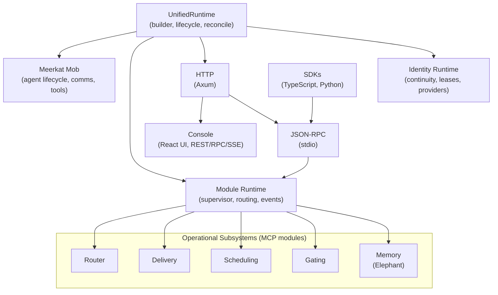
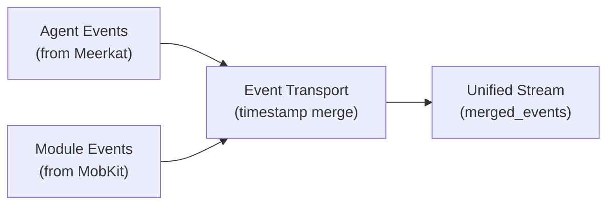

MobKit is a Rust crate plus SDKs, examples, and a React console, designed as a companion to the Meerkat multi-agent runtime. It handles the operational concerns that surround agent execution: startup, module supervision, identity-first continuity, routing, delivery, scheduling, gating, memory, sessions, cross-mob wiring, console projection, and administration.

## Design principles

1. **Data over callbacks** -- module communication uses serialized JSON messages, not function pointers or trait objects
2. **Hot paths in-process** -- core routing and event merging happen in the main process; operational subsystems run as MCP modules
3. **Two modes** -- library mode (direct Rust calls) and RPC mode (JSON-RPC via stdio) for the same functionality
4. **Apps own policy, MobKit owns mechanism** -- applications decide who exists and who is wired; MobKit supplies the spawn, route, reconcile, persist, stream, and inspect machinery

## High-level architecture


```mermaid
graph TD
    MOB["Meerkat Mob<br/>(agent lifecycle, comms, tools)"]
    UNIFIED["UnifiedRuntime<br/>(builder, lifecycle, reconcile)"]
    MODULES["Module Runtime<br/>(supervisor, routing, events)"]
    CONSOLE["Console<br/>(React UI, REST/RPC/SSE)"]
    IDENTITY["Identity Runtime<br/>(continuity, leases, providers)"]

    subgraph subsystems["Operational Subsystems (MCP modules)"]
        ROUTER["Router"]
        DELIVERY["Delivery"]
        SCHEDULING["Scheduling"]
        GATING["Gating"]
        MEMORY["Memory<br/>(Elephant)"]
    end

    RPC["JSON-RPC<br/>(stdio)"]
    HTTP["HTTP<br/>(Axum)"]
    SDKs["SDKs<br/>(TypeScript, Python)"]

    UNIFIED --> MOB
    UNIFIED --> MODULES
    UNIFIED --> HTTP
    UNIFIED --> IDENTITY

    MODULES --> ROUTER
    MODULES --> DELIVERY
    MODULES --> SCHEDULING
    MODULES --> GATING
    MODULES --> MEMORY

    HTTP --> CONSOLE
    RPC --> MODULES
    SDKs --> RPC
    HTTP --> RPC
```

## Crate structure

The core Rust crate is organized around explicit boundary modules:

```
meerkat-mobkit/src/
├── lib.rs                    # Public API exports and module map
├── types.rs                  # Core data structures
├── auth/                     # JWT/OIDC validation and signed peer keys
├── baseline.rs               # Meerkat prerequisite verification
├── blob_store.rs             # Binary/blob storage adapters
├── config_convention.rs      # Conventional config discovery
├── console_aggregator/       # Console timeline/log store, replay, send state
├── console_config.rs         # TOML-backed view-level console config
├── console_contracts.rs      # Console-facing protocol envelopes/errors
├── contact_directory.rs      # Cross-mob contact registry
├── decisions.rs              # Policy enforcement
├── governance.rs             # Release candidate tracking
├── http_console.rs           # Console REST, JSON-RPC, timeline SSE, blobs
├── http_sse.rs               # Agent, mob, and structural mob SSE
├── identity_first/           # Durable identity runtime, leases, stores, bridge
├── mob_handle_runtime.rs     # Meerkat mob integration
├── process.rs                # Subprocess JSON-line protocol
├── protocol.rs               # Event protocol parsing
├── rpc.rs                    # JSON-RPC handler + sub-modules
│   ├── console_ingress.rs
│   ├── gating_methods.rs
│   ├── memory_methods.rs
│   ├── routing_delivery_methods.rs
│   ├── session_store_methods.rs
│   └── subscribe_methods.rs
├── runtime/                  # Runtime implementation
│   ├── bootstrap.rs          # Module startup
│   ├── console_ingress.rs    # Console REST projection
│   ├── cross_mob_control.rs  # Local cross-mob control plane
│   ├── cross_mob_remote.rs   # Remote cross-mob wiring helpers
│   ├── delivery.rs           # Delivery subsystem
│   ├── event_transport.rs    # Event stream merging
│   ├── gating.rs             # Gating subsystem
│   ├── memory.rs             # Elephant integration
│   ├── metadata.rs           # Runtime metadata table
│   ├── module_boundary.rs    # MCP/subprocess boundary
│   ├── rpc.rs                # Runtime JSON-RPC helpers
│   ├── routing.rs            # Route resolution
│   ├── session_store.rs      # Persistence backends
│   └── supervisor.rs         # Process supervision
├── unified_runtime/          # Builder, lifecycle, event log, edge reconcile
└── mocks.rs                  # Test utilities
```

## Module boundary

The module boundary layer provides two communication paths:

### MCP path (core modules)

Core modules expose MCP tools. The boundary calls `call_module_mcp_tool_json` with a tool name and arguments, receives a JSON response, and parses it into the expected type.

```
Runtime → call_module_mcp_tool_json → Module MCP Server → Response → Parse
```

Key MCP tools per module:

| Module | Tools |
|--------|-------|
| router | `routing.resolve` |
| delivery | `delivery.send` |
| gating | `gating.evaluate`, `gating.decide` |
| memory | `memory.index`, `memory.query`, `memory.conflict_read` |

### Subprocess path (custom modules)

Custom modules communicate over JSON lines on stdio. The boundary uses `run_process_json_line` to send a request and read a response.

```
Runtime → write JSON line to stdin → Module process → read JSON line from stdout → Parse
```

## Event transport

The event transport merges two event sources:


```mermaid
graph LR
    AGENT["Agent Events<br/>(from Meerkat)"] --> MERGE["Event Transport<br/>(timestamp merge)"]
    MODULE["Module Events<br/>(from MobKit)"] --> MERGE
    MERGE --> UNIFIED["Unified Stream<br/>(merged_events)"]
```

Events are sorted by `timestamp_ms`. Same-timestamp events preserve source ordering (agent before module).

## Supervisor design

The supervisor manages module processes with a simple state machine:

| Input | From state | To state | Action |
|-------|------------|----------|--------|
| Process spawned | -- | Starting | Begin health polling |
| Health check OK | Starting | Healthy | Mark ready |
| Health check fail | Starting | Unhealthy | Check restart policy |
| Process exit (0) | Healthy | Unhealthy | Check restart policy |
| Process exit (non-0) | Healthy | Unhealthy | Check restart policy |
| Restart triggered | Unhealthy | Restarting | Respawn process |
| Respawn complete | Restarting | Starting | Begin health polling |

## HTTP composition

The runtime composes two Axum router layers:

| Layer | Routes | Purpose |
|-------|--------|---------|
| Frontend | `/console`, `/console/assets/*` | Static HTML + JS |
| JSON API | `/console/experience`, `/console/modules`, `/console/identities`, `/console/timeline` | Runtime and console timeline state |
| Console RPC | `/console/rpc`, `/console/rpc/multipart` | Console commands, identity inspection, send, blob upload |
| Console SSE | `/console/timeline/stream`, `/console/identity/{identity}/stream` | Timeline replay and live continuation |
| Blob serving | `/blobs/{blob_id}` | Console image/blob content |

Routers are merged into a single `axum::Router` served on the configured port.

## Dependencies

### External crates

| Crate | Purpose |
|-------|---------|
| `tokio` | Async runtime |
| `axum` | HTTP framework |
| `serde` / `serde_json` | Serialization |
| `reqwest` | HTTP client |
| `chrono` | Time |
| `hmac` / `sha2` / `ed25519-dalek` | JWT and peer-key cryptography |
| `toml` | Configuration parsing |

### Meerkat crates

| Crate | Used for |
|-------|----------|
| `meerkat-core` | Agent events, session types, comms |
| `meerkat-mob` | Mob runtime, member specs, event routing |
| `meerkat-mcp` | MCP protocol types |
| `meerkat-client` | LLM client (for mob bootstrap) |
| `meerkat-runtime` / `meerkat-session` / `meerkat-store` | Runtime/session persistence adapters |

## Security model

1. **Trusted modules** -- only modules declared in `mobkit.toml` are loaded
2. **JWT validation** -- OIDC-based auth with local signature verification
3. **Email allowlist** -- access restricted to configured identities
4. **Non-ambient console credentials** -- console mutation routes expect bearer tokens or explicit SSE query tokens when auth is required
5. **Signed remote cross-mob contacts** -- TCP/UDS peer descriptors require real Ed25519 pubkeys; in-process wiring is authorized through the identity map
6. **Forged resolution detection** -- delivery validates routing resolutions against trusted store
7. **Rate limiting** -- per-route sliding window rate limits on delivery

## See also

- [Modules](/concepts/modules) -- module configuration
- [Unified runtime guide](/guides/unified-runtime) -- bootstrap details
- [Decisions](/reference/decisions) -- policy enforcement
- [Meerkat architecture](https://github.com/lukacf/meerkat) -- the companion runtime
